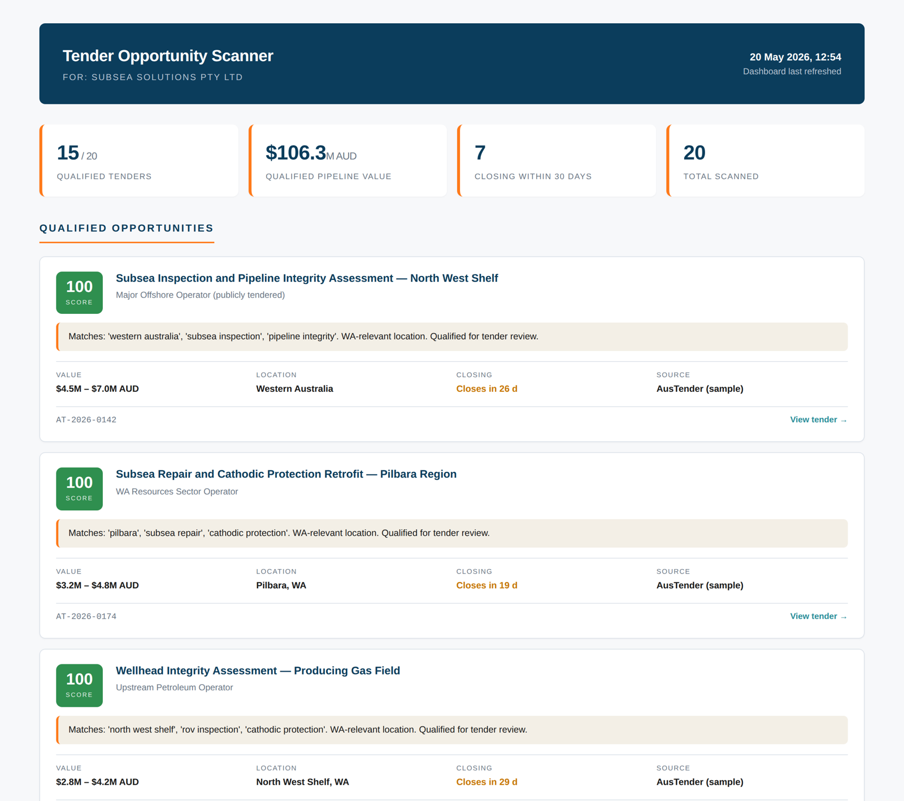

# 03 — Tender Opportunity Scanner

> A commercial-intelligence proof of concept: scan public tender feeds, score each opportunity against a configurable service profile, and produce a dashboard of qualified leads — with transparent reasoning for every score.

Built as a portfolio piece bridging my Information Technology background to a Commercial & Marketing vacation role in the offshore services sector.



---

## Why this exists

In B2B services industries — subsea inspection, offshore engineering, marine asset integrity — new business is almost never won through advertising. It is won through **tender response**. A commercial team's morning routine includes scanning AusTender, state government portals, and industry mailing lists for opportunities that match the company's capabilities and location.

This routine is usually manual, time-consuming, and biased by whoever happens to be looking. It is also the kind of task where a small amount of code goes a very long way.

I built this tool to demonstrate three things at once:

1. **Commercial judgement** — knowing what makes an offshore-services tender worth pursuing
2. **Technical capability** — Python, SQL, configuration-driven design, clean architecture
3. **Polished output** — the kind of dashboard a marketing team would actually use, not a developer toy

## What it does

1. **Loads tenders** from a configured source (bundled sample data, or a live AusTender adapter — see "Live sources" below)
2. **Scores each one** using a weighted multi-tier algorithm that combines keyword matching, geographic relevance, value tier, urgency, and negative-keyword suppression
3. **Persists** results in a SQLite database, so re-runs deduplicate and track which tenders have been visible for how long
4. **Renders a dashboard** as a single self-contained HTML file showing qualified opportunities, total pipeline value, and a transparent "filtered out" table with reasons

## One-command demo

```bash
git clone https://github.com/<your-username>/commercial-marketing-portfolio.git
cd commercial-marketing-portfolio/03-tender-opportunity-scanner

pip install -r requirements.txt
python3 scan.py
```

Output:

```
Loaded 20 tenders for Subsea Solutions Pty Ltd
  ✓ [100]  AT-2026-0142  Subsea Inspection and Pipeline Integrity Assessment — North West
  ✓ [100]  AT-2026-0174  Subsea Repair and Cathodic Protection Retrofit — Pilbara Region
  ✓ [100]  AT-2026-0288  Wellhead Integrity Assessment — Producing Gas Field
  ...
  · [  0]  AT-2026-0332  Office Furniture Supply — Regional Government Offices
  · [  0]  AT-2026-0367  Software Development — Asset Management Platform

Qualified: 15 / 20
Dashboard: output/dashboard.html
```

Open `output/dashboard.html` in any browser.

## The scoring algorithm — the interesting part

A naive keyword match — "does this tender contain 'inspection'?" — gives terrible results. Half a council's tenders contain the word "inspection" and most have nothing to do with subsea services.

What works is a **weighted multi-signal scoring engine**. The configuration lives in `config/keywords.yaml` and can be retuned for any service line:

| Signal | What it does | Configurable weight |
|---|---|---|
| **Tier 1 keywords** | Direct matches for the core service (`subsea inspection`, `rov inspection`, `pipeline integrity`) | +30 each |
| **Tier 2 keywords** | Adjacent industry vocabulary (`offshore`, `subsea`, `fpso`, `riser`) | +15 each |
| **Tier 3 keywords** | Weak corroborating signals (`marine`, `vessel`, `survey`) | +5 each |
| **Sector boost** | Broader industry match (`oil and gas`, `petroleum`, `lng`) | +10 (once) |
| **Negative keywords** | Wrong-industry suppressors (`catering`, `office furniture`, `it services`) | −20 each |
| **Value bonus** | Reward higher-value opportunities | +10 / +20 / +30 by tier |
| **Time bonus** | Reward urgency | +5 if closing in 30 days |
| **Geographic multiplier** | Amplify WA / Perth / Pilbara matches | ×1.3 on the running total |
| **Qualification threshold** | Below this, tender is filtered out | 40 (configurable) |

The geographic multiplier is **applied last and only to positive scores** — multiplying a negative score would mislead the operator into thinking a WA location is hurting an irrelevant tender, which would be confusing.

Each match is recorded as a `Signal` with kind, term, and points, then assembled into a short rationale string for the dashboard. Every score is auditable: the user can see which terms triggered the result.

## What the dashboard looks like

The browser-rendered HTML has:

- A **summary header** with count of qualified vs. total, pipeline value, count closing soon
- **Cards for qualified opportunities**, each showing score badge (colour-coded green/teal/amber/grey), title, agency, plain-English rationale, value range, location, closing urgency, and a deep link to the tender
- A **filtered-out table** showing sub-threshold tenders with their reasons — so the operator can sanity-check the algorithm and tune the config if needed

## Architecture

```
03-tender-opportunity-scanner/
├── scan.py                     CLI entry point — one command runs the whole pipeline
├── requirements.txt
├── scanner/
│   ├── __init__.py
│   ├── sources.py              Adapters for different tender feeds (sample, AusTender)
│   ├── scoring.py              Weighted scoring engine — the smart part
│   ├── storage.py              SQLite persistence with upsert-by-tender-id
│   └── report.py               Self-contained HTML dashboard generator
├── config/
│   └── keywords.yaml           Tunable keyword/weight configuration
├── data/
│   ├── sample_tenders.json     Realistic sample data (20 records)
│   └── tenders.db              SQLite store (created on first run)
└── output/
    └── dashboard.html          Generated dashboard
```

The four scanner modules are deliberately small and separated. Adding a new tender source means writing one class in `sources.py` and changing nothing else. Retuning for a different service line — say, geotechnical surveys or marine renewables — means editing only `keywords.yaml`.

## Live sources

The sample data file is shipped so the demo runs offline. A live `AusTenderSource` adapter is sketched in `scanner/sources.py` with a complete plan in the docstring (request listings, parse with BeautifulSoup, paginate, respect rate limits) but is intentionally stubbed in this proof of concept.

In a production version you would also add:

- AusTender official CSV/XML exports as a more stable source than HTML scraping
- WA government tender portal adapter
- Industry-specific mailing lists (NOPSEMA, APPEA, Subsea UK Australia)
- A scheduled cron run with email digest of new qualified tenders

## Known limitations

I want this README to be honest about what this is and isn't.

- **Sample data is illustrative.** The 20 tenders shipped are realistic but fictional. Real AusTender records have more fields and more boilerplate.
- **No NLP, just keyword matching.** A more advanced version would use sentence embeddings to catch paraphrasing (e.g. "underwater integrity assessment" matching "subsea inspection"). For now, keywords cover the most common phrasing.
- **Edge cases need human review.** For example, "catering services on a subsea construction vessel" currently scores just above the 40-point threshold because positive offshore vocabulary slightly outweighs the −20 catering penalty. The honest behaviour is to surface it with a rationale ("but penalised by 'catering'") and let the operator decide — which the dashboard does.
- **No authentication-protected sources.** Many of the most valuable opportunity feeds are member-only (e.g. industry association lists). Those would need a logged-in scraping flow not included here.

## What this demonstrates for a Commercial & Marketing role

- **Commercial judgement**: understanding which opportunities are worth tendering for, and why
- **Process thinking**: a real marketing/commercial team's morning routine, codified
- **Configuration-driven design**: business users (not just developers) can retune the engine by editing one YAML file
- **Transparent reasoning**: every score has a one-sentence rationale, so the algorithm is auditable rather than a black box
- **Useful output**: the dashboard could be shared with a sales team in its current form

## Author

**Mohammed Habibur Rahman Bhuyan Abir** ("Abir")
Bachelor of Information Technology (Business Information Systems) — Murdoch University, Perth · Graduating December 2026
[linkedin.com/in/abir-bhuyan](https://www.linkedin.com/in/abir-bhuyan) · habiburrahmanabeer@gmail.com

## Disclaimer

This is a portfolio proof of concept. The fictional company name, sample tender data, and AusTender URLs are illustrative. The architectural patterns and scoring logic are real and would scale to a production system with the additions noted above.
